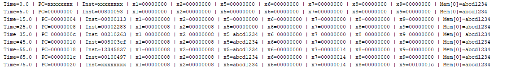
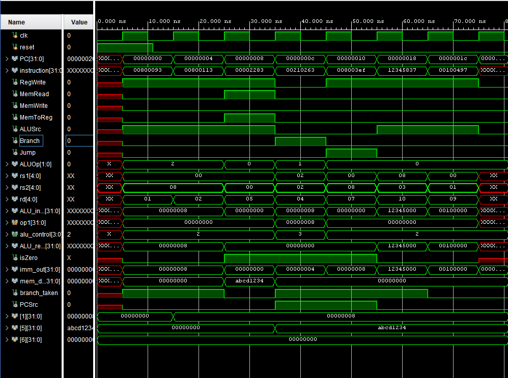
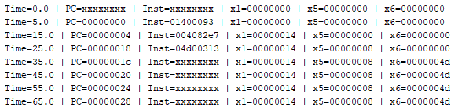
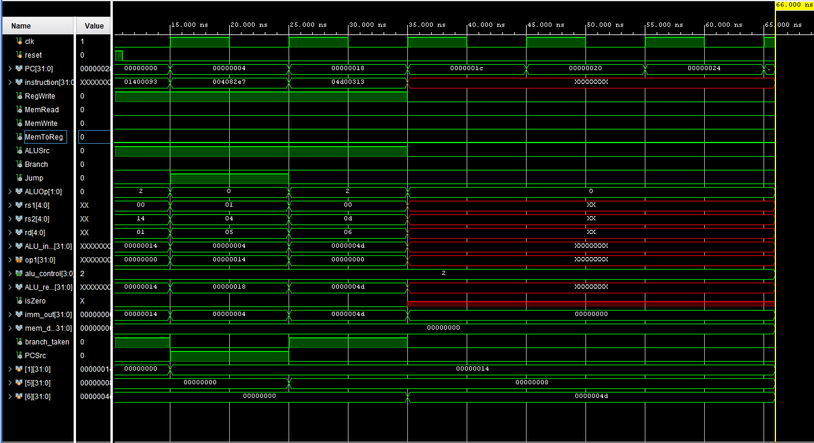

# RISC-V Single-Cycle CPU in Verilog

This project implements a self-designed 32-bit RISC-V single-cycle CPU in Verilog HDL, simulating the core of a modern processor in a simplified single-cycle architecture. The design supports a functional subset of the RV32I instruction set, covering arithmetic, logical, memory, branch, and jump instructions.

Each instruction is fetched, decoded, and executed within one clock cycle, with clearly separated modules such as the ALU, Register File, Control Unit, Instruction/Data Memory, and Branch Comparator. The project includes testbenches, waveform outputs, and console logs to validate correctness and demonstrate instruction flow.

This project follows principles from Digital Design and Computer Architecture by Harris & Harris and is intended for learning, experimentation, and further development into pipelined architecture.

---

## Features

- Supports key instruction types from the RV32I ISA:
  - Arithmetic: `add`, `addi`
  - Logical: `and`, `or`, `xor`, `sll`, `srl`, `sra`, `slt`, `sltu`
  - Memory access: `lw`, `sw`
  - Control transfer: `beq`, `jal`, `jalr`
  - Immediate operations: `lui`, `auipc`
- Modular architecture:
  - Program Counter
  - Instruction Memory
  - Control Unit
  - Register File
  - Immediate Generator
  - ALU and ALU Control
  - Data Memory
  - Branch Comparator
  - Multiplexers for control logic
- Functional testbenches included
- Waveform and console outputs for debugging and verification
- Based on the architecture described in "Digital Design and Computer Architecture" by David Harris and Sarah Harris

---

## Folder Structure
```
riscv-single-cycle-cpu/
├── src/ # Verilog modules
│ ├── ALU.v
│ ├── ALUControl.v
│ ├── ALUSrc_MUX.v
│ ├── BranchComparator.v
│ ├── ControlUnit.v
│ ├── data_memory.v
│ ├── Immediate_Generator.v
│ ├── instruction_memory.v
│ ├── MemToReg_MUX.v
│ ├── PC.v
│ ├── PCAdder.v
│ ├── PCSrc_MUX.v
│ ├── RegisterFile.v
│ └── SingleCycleCPU.v
│
├── testbench/ # Simulation testbenches
│ ├── ALU_tb.v
│ ├── ALUControl_tb.v
│ ├── ControlUnit_tb.v
│ ├── CPU_tb.v
│ ├── data_memory_tb.v
│ ├── Immediate_Generator_tb.v
│ ├── instruction_memory_tb.v
│ ├── PC_tb.v
│ └── RegisterFile_tb.v
│
├── outputs/ # Simulation outputs
│ ├── TC1Console.png
│ ├── TC1Waveform.png
│ ├── TC2Console.png
│ ├── TC2Waveform.png
│ ├── TC3Console.png
│ └── TC3Waveform.png
│
└── README.md # Project documentation
```


---

### Notes

- **`src/`** contains all RTL (Register Transfer Level) Verilog modules.
- **`testbench/`** contains testbenches to simulate and verify functionality.
- **`outputs/`** includes visual results (waveforms and console logs) of simulation for each test case.
- **`README.md`** includes project overview, features, test cases, and references.

## Test Case 1 – Arithmetic and Store Instructions

**Assembly Instructions:**
```assembly
addi x1, x0, 5      # x1 = 5
addi x2, x0, 10     # x2 = 10
add  x3, x1, x2     # x3 = x1 + x2 = 15
sw   x3, 0(x0)      # Store x3 to memory[0]
```

**Machine Code (to be put in program.mem):**
<pre>
00500093
00a00113
002081b3
00302023
</pre>

**Data Memory (to be put in data.mem):**
<pre>
ABCD1234
00000000
00000000
  ...
00000000
</pre>

**Console Output:**


**Output Waveform:**


This test verifies:
- Correct functionality of arithmetic instructions (`addi`, `add`)
- Proper data routing through the ALU
- Register file reads and writes
- Memory store via `sw`

## Test Case 2 – Branch, Jump, Load, and Upper Immediate

**Assembly Instructions:**
```assembly
addi x1, x0, 8        # x1 = 8
addi x2, x0, 8        # x2 = 8
lw   x5, 0(x0)        # x5 = mem[0] = 0xABCD1234
beq  x1, x2, +8       # Branch taken → skip jal
jal  x6, 8            # Will be skipped if branch taken
jalr x7, 0(x1)        # Jump to address in x1 (PC = 8)
lui  x8, 0x12345      # x8 = 0x12345000
auipc x9, 0x00001     # x9 = PC + 0x1000
```

**Machine Code (to be put in program.mem):**
<pre>
00800093
00800113
00002283
00210263
008003ef
000080e7
12345837
00100497

</pre>

**Data Memory (to be put in data.mem):**
<pre>
ABCD1234
00000000
00000000
  ...
00000000
</pre>

**Console Output:**


**Output Waveform:**


This test verifies:
- **Branch control**: conditional branching with `beq`
- **Jump logic**: absolute (`jal`) and indirect (`jalr`) jumps
- **Memory load** with `lw`
- **Immediate value handling** in `lui` and `auipc`
- Proper program counter updates and instruction skipping

## Test Case 3 – Jump and Resume Execution

**Assembly Instructions:**
```assembly
addi x1, x0, 20       # x1 = 20 (jump target)
jalr x5, x1, 4        # x5 = PC + 4; PC = x1 + 4 = 24
addi x6, x0, 77       # Executed after jump (at PC = 24)
```

**Machine Code (to be put in program.mem):**
<pre>
01400093
004082e7
00000013
00000013
00000013
00000013
04d00313
</pre>

The machine code has NOP instructions in between so as to put the instruction to be executed after jump at 0x24.

**Data Memory (to be put in data.mem):**
<pre>
ABCD1234
00000000
00000000
  ...
00000000
</pre>

**Console Output:**


**Output Waveform:**


This test verifies:
- Correct execution of `jalr`
- Jumping over intermediate instructions (simulated `nop`s)
- Return address storage in `x5`
- Resumption of instruction execution at the computed PC

## Reference

Sarah L. Harris and David Harris,  
*Digital Design and Computer Architecture: RISC-V Edition*


