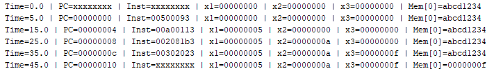
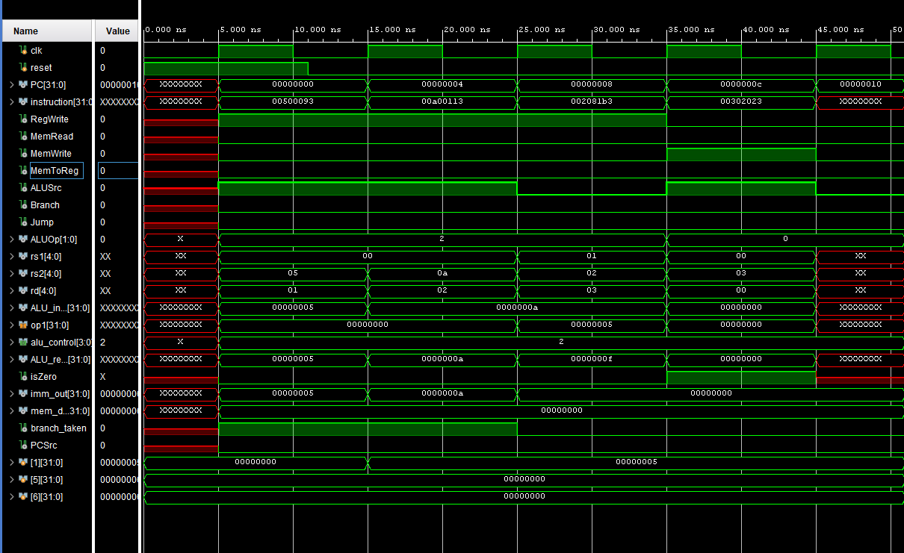

# RISC-V Single-Cycle CPU in Verilog

This project implements a self-designed 32-bit RISC-V single-cycle CPU in Verilog HDL, simulating the core of a modern processor in a simplified single-cycle architecture. The design supports a functional subset of the RV32I instruction set, covering arithmetic, logical, memory, branch, and jump instructions.

Each instruction is fetched, decoded, and executed within one clock cycle, with clearly separated modules such as the ALU, Register File, Control Unit, Instruction/Data Memory, and Branch Comparator. The project includes testbenches, waveform outputs, and console logs to validate correctness and demonstrate instruction flow.

This project follows principles from Digital Design and Computer Architecture by Harris & Harris and is intended for learning, experimentation, and further development into pipelined architecture.

---

## Features

- Supports key instruction types from the RV32I ISA:
  - Arithmetic: `add`, `addi`
  - Logical: `and`, `or`, `xor`, `sll`, `srl`, `sra`, `slt`, `sltu`
  - Memory access: `lw`, `sw`
  - Control transfer: `beq`, `jal`, `jalr`
  - Immediate operations: `lui`, `auipc`
- Modular architecture:
  - Program Counter
  - Instruction Memory
  - Control Unit
  - Register File
  - Immediate Generator
  - ALU and ALU Control
  - Data Memory
  - Branch Comparator
  - Multiplexers for control logic
- Functional testbenches included
- Waveform and console outputs for debugging and verification
- Based on the architecture described in "Digital Design and Computer Architecture" by David Harris and Sarah Harris

---

## Folder Structure
```
riscv-single-cycle-cpu/
├── src/ # Verilog modules
│ ├── ALU.v
│ ├── ALUControl.v
│ ├── ALUSrc_MUX.v
│ ├── BranchComparator.v
│ ├── ControlUnit.v
│ ├── data_memory.v
│ ├── Immediate_Generator.v
│ ├── instruction_memory.v
│ ├── MemToReg_MUX.v
│ ├── PC.v
│ ├── PCAdder.v
│ ├── PCSrc_MUX.v
│ ├── RegisterFile.v
│ └── SingleCycleCPU.v
│
├── testbench/ # Simulation testbenches
│ ├── ALU_tb.v
│ ├── ALUControl_tb.v
│ ├── ControlUnit_tb.v
│ ├── CPU_tb.v
│ ├── data_memory_tb.v
│ ├── Immediate_Generator_tb.v
│ ├── instruction_memory_tb.v
│ ├── PC_tb.v
│ └── RegisterFile_tb.v
│
├── outputs/ # Simulation outputs
│ ├── TC1Console.png
│ ├── TC1Waveform.png
│ ├── TC2Console.png
│ ├── TC2Waveform.png
│ ├── TC3Console.png
│ └── TC3Waveform.png
│
└── README.md # Project documentation
```


---

### Notes

- **`src/`** contains all RTL (Register Transfer Level) Verilog modules.
- **`testbench/`** contains testbenches to simulate and verify functionality.
- **`outputs/`** includes visual results (waveforms and console logs) of simulation for each test case.
- **`README.md`** includes project overview, features, test cases, and references.

## Test Case 1 – Arithmetic and Store Instructions

**Assembly Instructions:**
```assembly
addi x1, x0, 5      # x1 = 5
addi x2, x0, 10     # x2 = 10
add  x3, x1, x2     # x3 = x1 + x2 = 15
sw   x3, 0(x0)      # Store x3 to memory[0]
```

### Machine Code (to be put in program.mem):
<pre>
00500093
00a00113
002081b3
00302023
</pre>

### Console Output:


### Output Waveform:


This test verifies:
- Correct functionality of arithmetic instructions (`addi`, `add`)
- Proper data routing through the ALU
- Register file reads and writes
- Memory store via `sw`

## Test Case 2 – Branch, Jump, Load, and Upper Immediate


